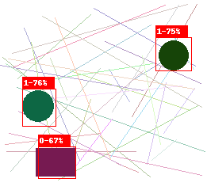
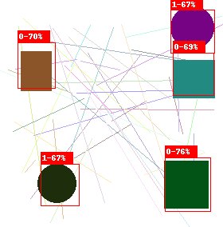
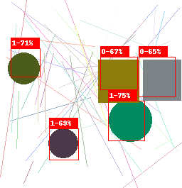
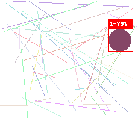
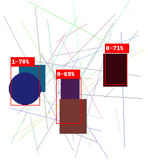
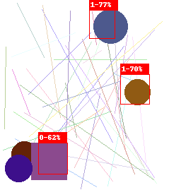

# YOLO (versão 1)

Este repositório é mais um que foi desenvolvido com objetivo de aprendizado para implementação de um modelo de detecção de objetos, utilizando a rede YOLO - versão 1. 

# Descrição

Foram feitas outras tentativas para aprendizado e essa é uma abordagem para implementar a rede de detecção de objetos.  

# Resultados

- Alguns resultados ficaram muito bons, embora precisem ser treinados por mais tempo. 

  
  
  
  

- Já para algumas imagens onde os objetos estão muito próximos, não foi possível detectá-los, conforme exibido abaixo:  

  
  

# Fonte
- [Paper Original](https://arxiv.org/pdf/1506.02640.pdf)  
- Uma paylist no YOUTUBE explicando de forma excelente os conceitos de deteção de objetos além da implementação da rede YOLO utilizando Pytorch: [Introduction to Object Detection in Deep Learning
](https://www.youtube.com/watch?v=t-phGBfPEZ4&list=PLhhyoLH6Ijfw0TpCTVTNk42NN08H6UvNq)
